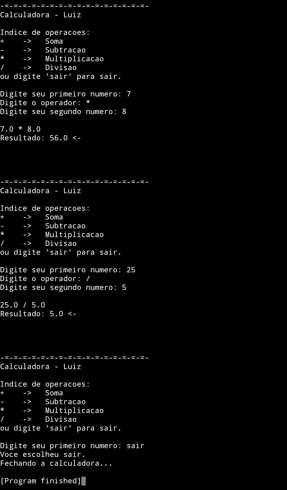

# Calculadora em Python

Projeto simples de uma calculadora feita em Python utilizando terminal/console.  
Desenvolvido por **Luiz Fernando**.

---

## Demonstração

  

---

## Sobre o projeto

Esta aplicação permite realizar operações matemáticas básicas diretamente pelo terminal de forma interativa.

O programa funciona em loop contínuo (`while True`), permitindo múltiplos cálculos até que o usuário decida sair.

---

## Lógica do programa

• O programa utiliza um loop infinito (while True).

• Valida se o usuário deseja sair em cada etapa.

• Converte os valores para float.

• Usa estruturas condicionais (if/elif) para executar a operação escolhida.

• Trata erros com try/except para evitar quebra do programa.

---

## Funcionalidades

- Operações básicas: soma, subtração, multiplicação e divisão.
- Execução contínua no terminal.
- Saída rápida digitando `sair` a qualquer momento.
- Tratamento de entradas inválidas.
- Proteção contra divisão por zero.
